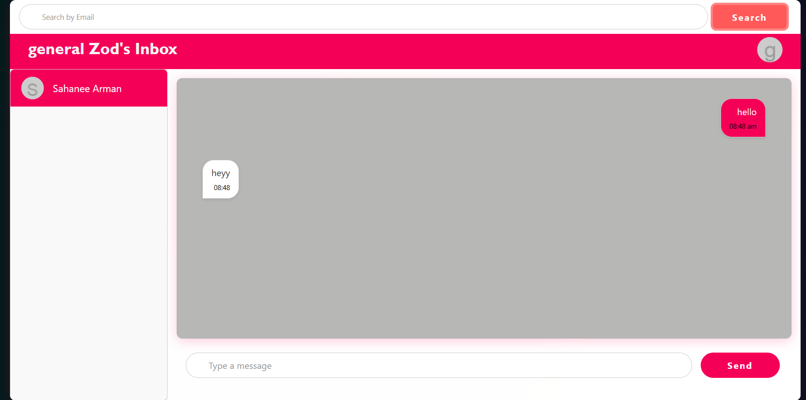
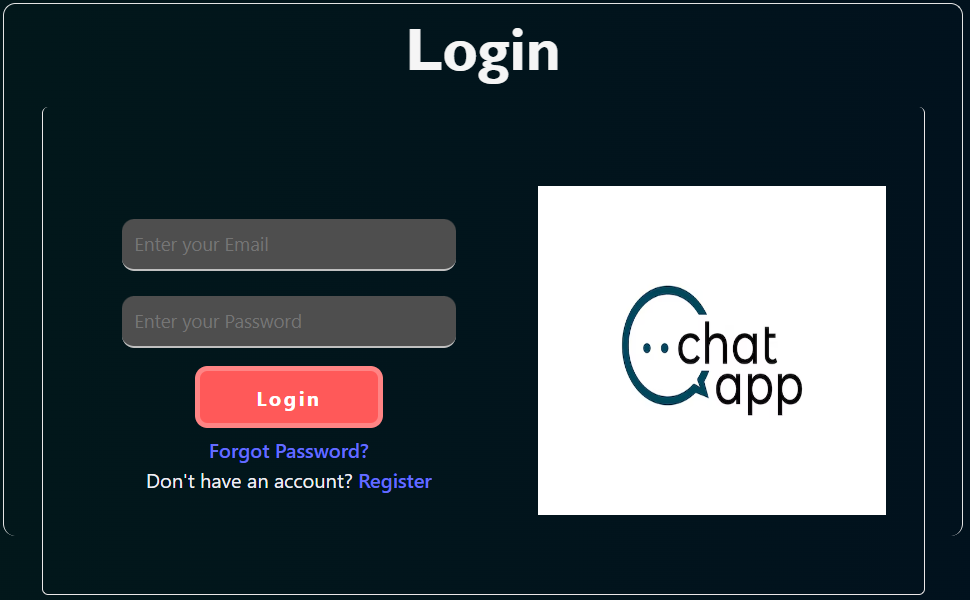

# Chat Application

A real-time chat application built with Node.js, Express, Sequelize (SQLite), React, and Socket.io. Users can register, log in, search for other users, add contacts, and engage in private, real-time conversations.

## Features

- **User Registration and Login**: Users can register and log in with their email and password.
- **Add Contacts**: Users can search for other users by email and add them as contacts.
- **Real-Time Chat**: Send and receive messages in real-time with private rooms created for each conversation.
- **Message History**: Users can fetch the message history of their conversations.
- **Responsive UI**: A simple and clean interface for chatting, viewing contacts, and managing user details.

## UI

## Tech Stack

- **Backend**:
  - Node.js
  - Express
  - Sequelize (SQLite for database)
  - bcrypt (for password hashing)
  - Socket.io (for real-time communication)
- **Frontend**:
  - React
  - Axios (for HTTP requests)
  - Socket.io-client (for real-time messaging)

## Setup and Installation

Clone the repository and navigate to the backend folder:
git clone https://github.com/your-repo/chat-app.git

**Backend**

1. cd chat-app/ChatServer
   npm install
   npm start or nodemon index.js

**Frontend**

2. cd chat-app/ChatClient
   npm install
   npm run dev
